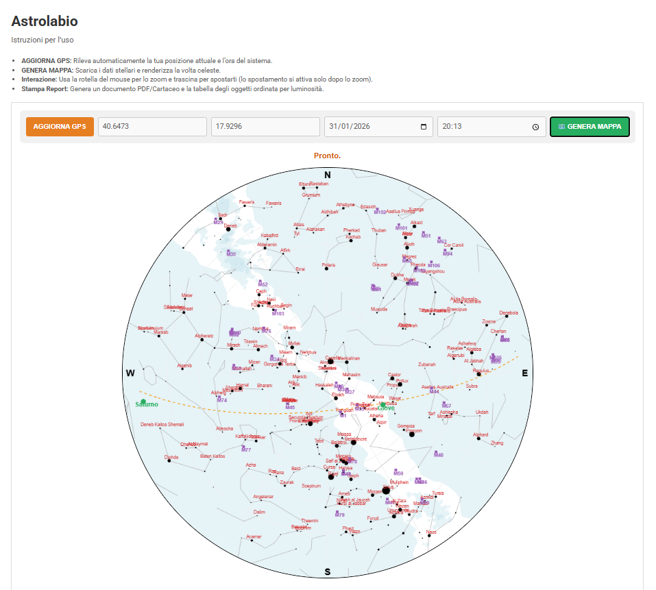
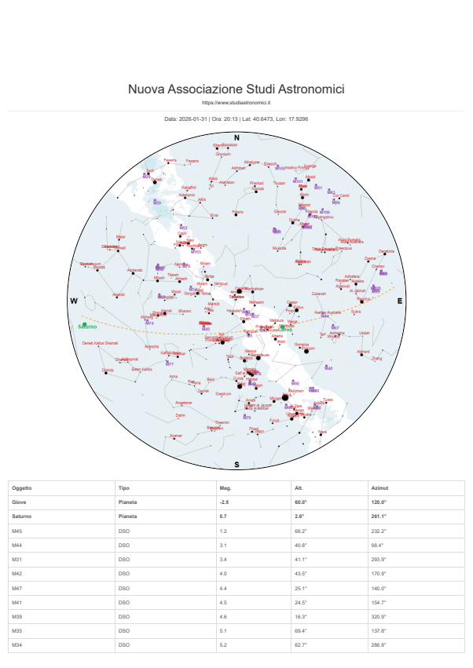

# 🔭 Astrolabio - WordPress Plugin

**Astrolabio** is a tool developed for the **Nuova Associazione Studi Astronomici**. It transforms any WordPress site into an interactive astrolabe, calculating the real-time positions of stars, planets, and deep-sky objects.

---

## 📸 Screenshots

  
  

---

## ✨ Key Features

- **Dynamic Star Map**: Real-time celestial rendering based on GPS coordinates.
- **Full Mobile Support**: Smooth navigation with native Touch events, including Pinch-to-Zoom and Dragging.
- **Advanced Astronomy**: Includes Ecliptic path, Milky Way visualization, and a complete Altazimuth grid.
- **Reports**: Generates high-quality, printable observation reports featuring the Association's official header.
- **Automated Data Table**: A dynamic list of visible celestial bodies, automatically sorted by magnitude (brightness).
- **Security Hardened**: Fully compliant with WordPress.org security standards (XSS protection and timezone synchronization).

---

## 🚀 Installation

1. Download the repository as a ZIP file.
2. Upload the `astrolabio` folder to your site's `/wp-content/plugins/` directory.
3. Activate the plugin through the WordPress Dashboard.
4. Ensure the `/data/` directory contains the required GeoJSON files for rendering (already included).

### Shortcode
To display the astrolabe on any page or post, simply use the following shortcode:

`[astro_observatory]`

---

## 🛠️ Technical Requirements

- **WordPress**: 5.0 or higher (Tested up to 6.9)
- **PHP**: 7.4 or higher
- **Browser**: Modern browsers with HTML5 Canvas support

## 📝 License

This project is licensed under the **GPLv2**. Please refer to the `LICENSE` file for further legal information.

---

  Developed by Ruben Giancarlo Elmo for the <strong>Nuova Associazione Studi Astronomici</strong> 
  <a href="https://www.studiastronomici.it">www.studiastronomici.it</a>

